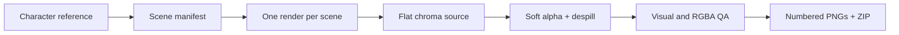

<div align="center">
  

  <h1>Sticker Pack Maker</h1>

  <p><strong>Build a coherent, validated sticker pack from one character reference.</strong></p>

  <p>
    A Codex Skill for scene planning, character consistency, exact bubble copy,
    chroma cleanup, RGBA validation, stable naming, and ZIP delivery.
  </p>

  <p>
    <a href="#install"><strong>Install the Skill</strong></a>
    ·
    <a href="https://github.com/NeoWeb3Nova/sticker-pack-maker-skill/releases/latest"><strong>Download the latest release</strong></a>
    ·
    <a href="skills/sticker-pack-maker/SKILL.md"><strong>Read SKILL.md</strong></a>
  </p>

  <p>
    <a href="https://github.com/NeoWeb3Nova/sticker-pack-maker-skill/actions/workflows/ci.yml"></a>
    <a href="https://github.com/NeoWeb3Nova/sticker-pack-maker-skill/releases/latest"></a>
    
    <a href="LICENSE"></a>
    <a href="https://github.com/NeoWeb3Nova/sticker-pack-maker-skill/stargazers"></a>
  </p>
</div>

## See the output first

These four files came from the workflow in this repository. Each one is a 1254×1254 RGBA PNG with transparent outer pixels and a stable scene name.

<table>
  <tr>
    <td align="center" width="25%"></td>
    <td align="center" width="25%"></td>
    <td align="center" width="25%"></td>
    <td align="center" width="25%"></td>
  </tr>
  <tr>
    <td align="center"><code>钱包连接</code></td>
    <td align="center"><code>DAO投票</code></td>
    <td align="center"><code>灵感来了</code></td>
    <td align="center"><code>人机协作</code></td>
  </tr>
</table>

## Run your first pack

Install the Skill, attach a character reference, and give Codex a prompt like this:

```text
Use $sticker-pack-maker to create 20 Chinese AI-workflow stickers from this
character reference. Preserve the face, hairstyle, black shirt, and exact
chest text. Deliver numbered transparent PNG files and a ZIP archive.
```

The Skill plans distinct scenes, generates each text-critical image separately, keeps completed work when a call stalls, removes the chroma background, validates every PNG, and packages the accepted files.

## Why sticker packs fail

Image generation solves one part of the job. A usable pack also needs production controls.

| Failure | What this Skill does |
| --- | --- |
| The character changes between scenes | Repeats a fixed character and style lock in every prompt |
| Bubble copy is misspelled | Keeps copy short, quotes it verbatim, and retries only the failed scene |
| A long batch stalls | Generates scene by scene and preserves completed source files |
| The background only looks transparent | Converts a flat key color into a soft RGBA matte |
| Blue or green edges remain | Cleans chroma spill on partially transparent fringe pixels |
| Files arrive out of order | Applies a manifest and numbered output names |
| A ZIP hides broken images | Checks count, dimensions, mode, alpha range, and all four corners first |

## The quality contract

Every accepted pack must satisfy the same checks:

```text
PASS: files=20 sizes=[(1254, 1254)]
```

- Every output is a PNG in RGBA mode.
- All files use the same dimensions.
- Alpha includes fully transparent and fully opaque pixels.
- All four canvas corners are transparent.
- Filenames are unique, numbered, and stable.
- The ZIP contains only accepted final PNG files.

The script covers deterministic checks. The Skill also requires visual review for character drift, wrong bubble copy, repeated poses, malformed hands, cropped borders, and damaged subject colors.

## How it works



The image model handles composition and expression. The local Python pipeline handles background removal, validation, naming, and packaging. That split keeps creative work flexible and delivery checks reproducible.

## Install

### Ask Codex to install it

```text
Install the sticker-pack-maker skill from
https://github.com/NeoWeb3Nova/sticker-pack-maker-skill/tree/main/skills/sticker-pack-maker
```

### Download the release

Download [the latest Skill archive](https://github.com/NeoWeb3Nova/sticker-pack-maker-skill/releases/latest), extract `sticker-pack-maker`, and place it under `~/.codex/skills/`.

<details>
<summary>Manual installation on macOS or Linux</summary>

```bash
git clone https://github.com/NeoWeb3Nova/sticker-pack-maker-skill.git
cp -R sticker-pack-maker-skill/skills/sticker-pack-maker ~/.codex/skills/
python -m pip install -r sticker-pack-maker-skill/requirements.txt
```

</details>

<details>
<summary>Manual installation on Windows PowerShell</summary>

```powershell
git clone https://github.com/NeoWeb3Nova/sticker-pack-maker-skill.git
Copy-Item -Recurse sticker-pack-maker-skill\skills\sticker-pack-maker "$HOME\.codex\skills\"
python -m pip install -r sticker-pack-maker-skill\requirements.txt
```

</details>

## Use the pipeline directly

You can run the deterministic post-processing step without invoking the full Skill:

```bash
python skills/sticker-pack-maker/scripts/sticker_pipeline.py process \
  --input-dir ./generated-chroma \
  --output-dir ./stickers-transparent \
  --zip ./stickers-transparent.zip \
  --expected-count 20 \
  --force
```

Validate an existing directory:

```bash
python skills/sticker-pack-maker/scripts/sticker_pipeline.py validate \
  --input-dir ./stickers-transparent \
  --expected-count 20
```

When a generator returns random filenames, pass a JSON manifest with `source` and `filename` for each scene. The repository includes manifest examples and a complete schema.

## Starter scene packs

| Pack | Scenes | Covers |
| --- | ---: | --- |
| [AI](skills/sticker-pack-maker/assets/scene-packs/ai.json) | 20 | prompting, generation, retrieval, agents, tools, review |
| [Web3](skills/sticker-pack-maker/assets/scene-packs/web3.json) | 20 | wallets, gas, bridging, minting, governance, audits |
| [Workplace](skills/sticker-pack-maker/assets/scene-packs/workplace.json) | 8 | acknowledgement, progress, meetings, completion, support |

Use these files as planning templates. Replace the copy, action, emotion, and filename fields to fit your audience.

## Practical limits

- One image per scene takes longer than a large batch. It also makes retries and review predictable.
- Image models can still miss exact in-image text. The workflow isolates that failure to one scene.
- Chroma removal works best when the subject avoids the selected key color. Choose a different key when the character needs blue or green details.
- Hair, smoke, glass, reflections, and translucent materials may need native transparency or manual cleanup.
- A style lock reduces character drift; it cannot guarantee pixel-identical identity across every model.

## What ships in the repository

```text
skills/sticker-pack-maker/
├── SKILL.md
├── agents/openai.yaml
├── scripts/sticker_pipeline.py
├── references/
│   ├── prompt-patterns.md
│   ├── quality-checklist.md
│   └── scene-planning.md
└── assets/scene-packs/
    ├── ai.json
    ├── web3.json
    └── workplace.json
```

The repository also includes unit tests, GitHub Actions CI, contribution guidance, security reporting, example output, and a [launch kit](docs/launch-kit.md). [PRODUCT.md](PRODUCT.md) and [DESIGN.md](DESIGN.md) record the positioning and visual decisions behind this page.

## Roadmap

- [ ] Telegram and WhatsApp export presets
- [ ] Contact-sheet generation
- [ ] Optional local OCR checks for bubble copy
- [ ] More community-maintained scene packs
- [ ] An edge-quality and consistency benchmark

## Contributing

Useful contributions include a reusable scene manifest, a reproducible edge case, a better matte algorithm, or documentation for another agent runtime. Read [CONTRIBUTING.md](CONTRIBUTING.md) before opening a pull request.

If you publish a pack with this Skill, open a [Show and tell discussion](https://github.com/NeoWeb3Nova/sticker-pack-maker-skill/discussions) with the result and the scene manifest. Good examples will be linked from this README.

## 中文说明

Sticker Pack Maker 把一张角色参考图变成一套经过校验的透明 PNG 表情包。它会规划不同场景，固定人物和画风，逐张处理气泡文字，保留已经生成的文件，再完成透明背景、软边清理、质量检查、命名和 ZIP 打包。

安装后可以直接这样使用：

```text
使用 $sticker-pack-maker，根据这张角色参考图制作 20 张中文 AI 场景表情包。
保持人物、发型、服装和胸前文字一致，交付编号透明 PNG 和 ZIP 压缩包。
```

## License

[MIT](LICENSE). The example images demonstrate the workflow. Use character references and generated assets that you have permission to publish.
